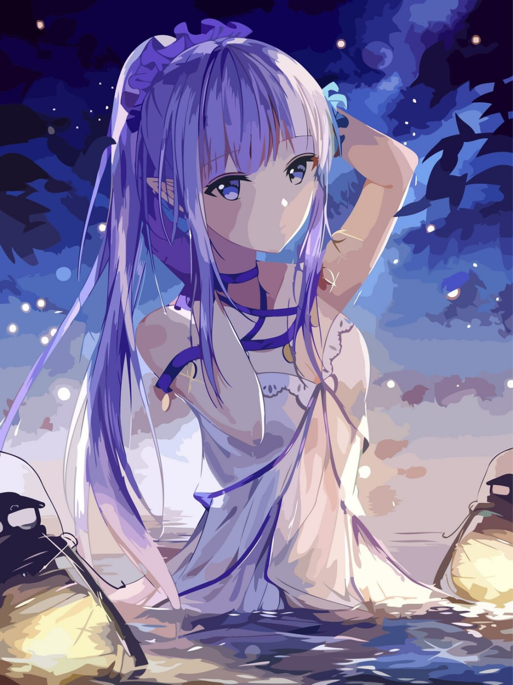
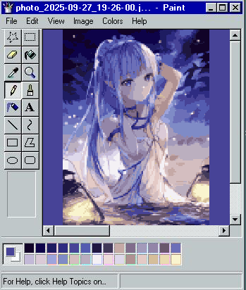

# PasteToOldPaintTemplate

Проект для преобразования изображений в пиксель-арт стиле с имитацией интерфейса старой версии Microsoft Paint.

<div align="center">
  <table>
    <tr>
      <td align="center">
        <strong>Оригинальное изображение</strong><br>
        
      </td>
      <td align="center">
        <strong>Преобразованное в стиле Paint</strong><br>
        
      </td>
    </tr>
  </table>
</div>

## Описание

Это консольное приложение на C#, которое:
1. Загружает изображение
2. Преобразует его в пиксель-арт с настраиваемым размером пикселя
3. Уменьшает количество цветов с помощью алгоритма K-mean
4. Вставляет результат в шаблон интерфейса старого Paint
5. Добавляет палитру цветов и заголовок

## Функциональность

- **Пикселизация** - преобразование изображения в блочный пиксель-арт
- **Уменьшение цветов** - алгоритм K-mean для ограничения палитры (до 28 цветов)
- **Шаблон Paint** - автоматическое размещение в интерфейсе классического Paint
- **Палитра цветов** - отображение использованных цветов в боковой панели
- **Заголовок** - добавление имени файла в заголовок окна

## Требования

- .NET 6.0 или выше
- Изображения в поддерживаемых форматах (BMP, JPEG, PNG и т.д.)

## Использование

1. Запустите приложение, передав путь к изображению как аргумент командной строки (перетащите изображение на exe файл):
2. Введите размер пикселя (целое число > 0)
3. Введите количество цветов в палитре (1-28, по умолчанию 28)
4. Программа создаст новое изображение с суффиксом `_PintPixel_ps{размер пикселя}_cc{количество цветов}`

## Особенности реализации

- Использует System.Drawing для работы с изображениями
- Реализует алгоритм K-mean для кластеризации цветов
- Точно воспроизводит вид классического Paint

## Пример использования
Сборка
```bash
dotnet publish -c Release -r win-x64 --self-contained true /p:PublishSingleFile=true
```
Использование
```bash
PasteToOldPaintTemplate.exe "C:\images\photo.jpg"
Input pixel size: 10
Input number of color palettes(default is 28): 16
```

## Ограничения
Максимальное количество цветов в палитре: 28
Длина заголовка обрезается после 27 символов

## Технические детали
Изображение масштабируется с сохранением пропорций
Фон заполняется самым частым цветом изображения
Используется nearest-neighbor интерполяция для сохранения пикселизации