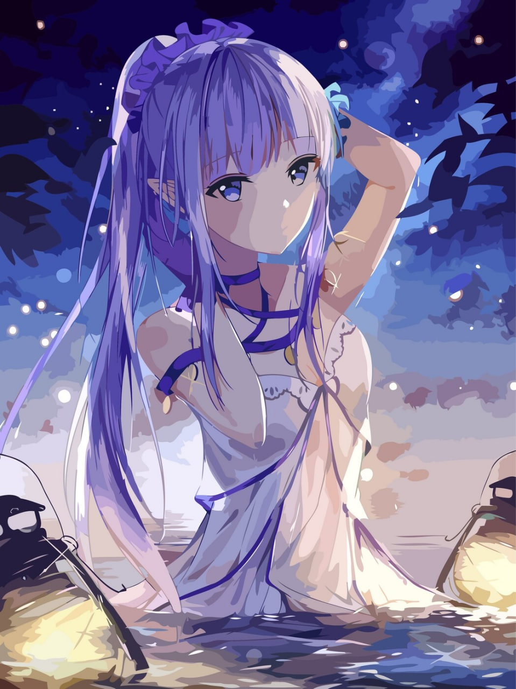
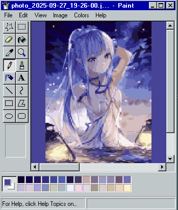

# PasteToOldPaintTemplate

Проект для преобразования изображений в пиксель-арт стиле с имитацией интерфейса старой версии Microsoft Paint.

<div align="center">
  <table>
    <tr>
      <td align="center">
        <strong>Оригинальное изображение</strong><br>
        
      </td>
      <td align="center">
        <strong>Преобразованное в стиле Paint</strong><br>
        
      </td>
    </tr>
  </table>
</div>

## Описание

Это консольное приложение на C#, которое:
1. Загружает изображение
2. Преобразует его в пиксель-арт с настраиваемым размером пикселя
3. Уменьшает количество цветов с помощью алгоритма K-mean
4. Вставляет результат в шаблон интерфейса старого Paint
5. Добавляет палитру цветов и заголовок

## Функциональность

- **Пикселизация** - преобразование изображения в блочный пиксель-арт
- **Уменьшение цветов** - алгоритм K-mean для ограничения палитры (до 28 цветов)
- **Шаблон Paint** - автоматическое размещение в интерфейсе классического Paint
- **Палитра цветов** - отображение использованных цветов в боковой панели
- **Заголовок** - добавление имени файла в заголовок окна

## Требования

- .NET 8.0 или выше
- Изображения в поддерживаемых форматах (BMP, JPEG, PNG и т.д.)

## Использование

```
PasteToOldPaintTemplate.exe <путь> [опции]

Опции:
  --input, -i <путь>              Путь к входному файлу
  --output, -o <путь>             Путь к выходному файлу
  --pixelate-size, -ps <число>    Размер блока пикселизации
  --max-colors, -mc <число>       Количество цветов палитры (1-28)
  --help, -h                      Показать справку
```

Если опции не переданы, программа запросит их интерактивно.

## Особенности реализации

- Использует System.Drawing для работы с изображениями
- Реализует алгоритм K-mean для кластеризации цветов
- Точно воспроизводит вид классического Paint

## Пример использования
Сборка
```bash
dotnet publish -c Release -r win-x64 --self-contained true /p:PublishSingleFile=true
```
Все аргументы через флаги
```bash
PasteToOldPaintTemplate.exe photo.jpg -ps 8 -mc 16 -o result.jpg
PasteToOldPaintTemplate.exe -i photo.jpg --pixelate-size 4 --max-colors 12
```
Интерактивный режим (без флагов)
```bash
PasteToOldPaintTemplate.exe "C:\images\photo.jpg"
Input pixel size: 10
Input number of color palettes(default is 28): 16
```
Частичное использование флагов (недостающие запрашиваются интерактивно)
```bash
PasteToOldPaintTemplate.exe photo.jpg -ps 8
```

## Ограничения
Максимальное количество цветов в палитре: 28
Длина заголовка обрезается после 27 символов

## Технические детали
Изображение масштабируется с сохранением пропорций
Фон заполняется самым частым цветом изображения
Используется nearest-neighbor интерполяция для сохранения пикселизации